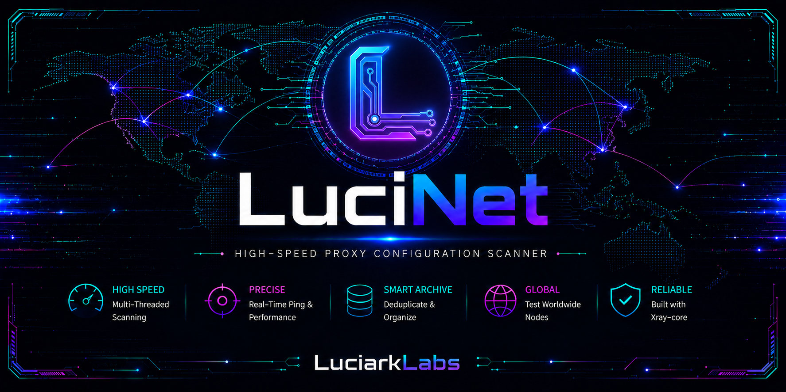
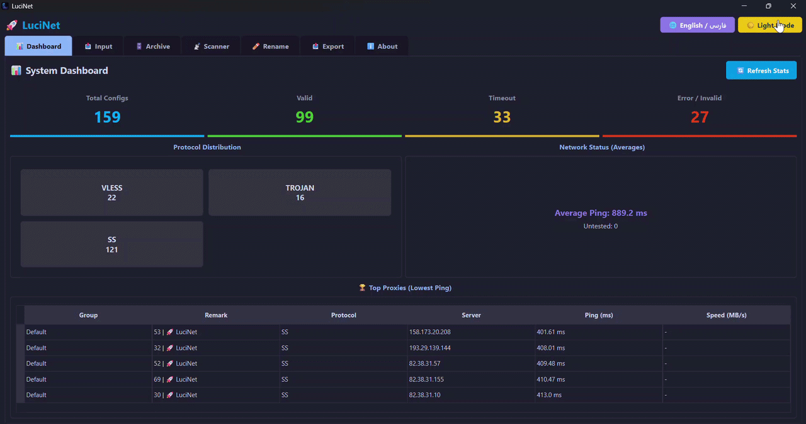
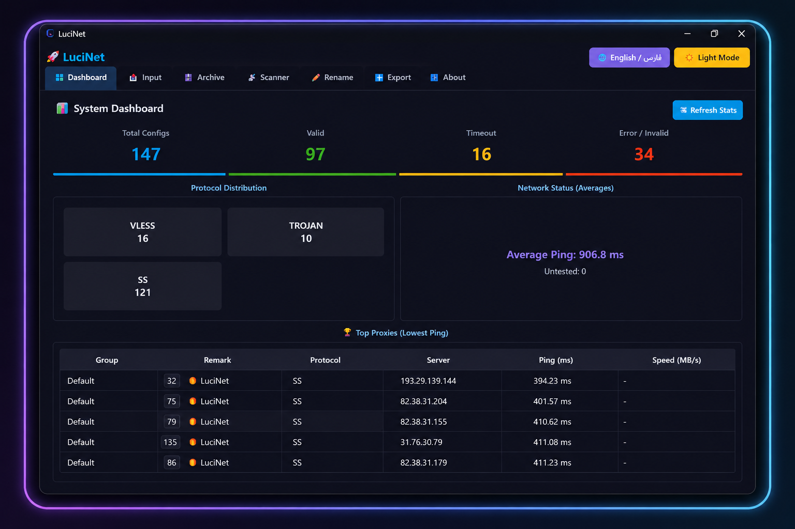
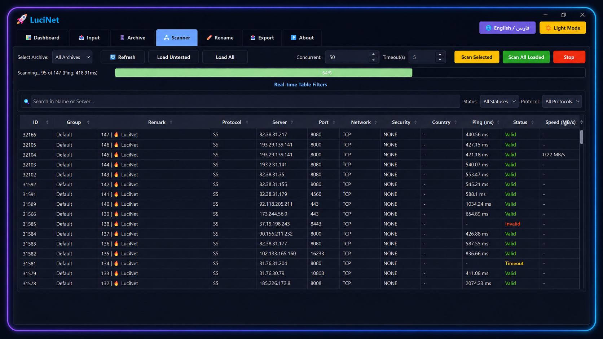
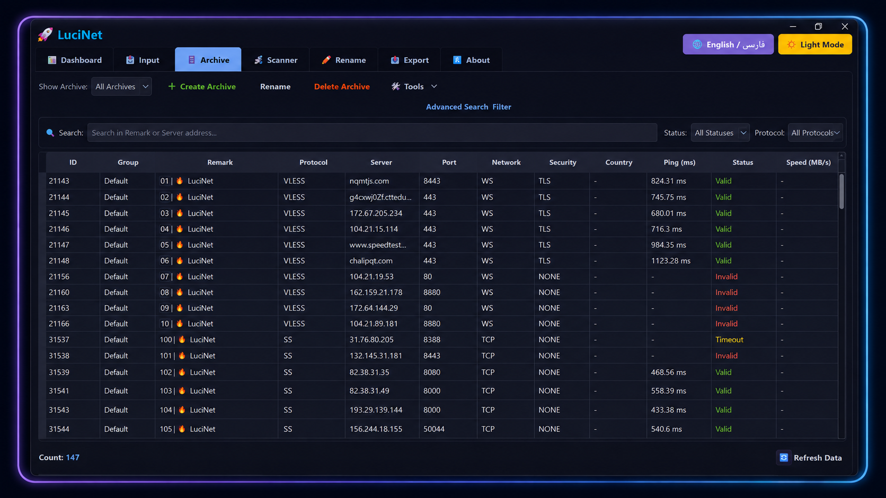

<div align="center">
  
</div>

<br>

<div align="center">
  
</div>

## 📖 About LuciNet

**LuciNet** is an advanced GUI-based desktop application developed by **LuciarkLabs** for managing, testing, and archiving proxy configurations. Built efficiently with Python (PySide6) and utilizing Xray-core, it delivers high-speed and precise scanning for handling massive config databases.

Whether you are scanning thousands of nodes for the lowest ping or sorting subscriptions smartly, LuciNet provides a seamless and automated experience with a stunning interface.

## ✨ Key Features

- ⚡ **High-Speed Concurrent Scanning:** Multi-threaded architecture utilizing Xray-core for rapid testing and real-time ping calculation.
- 📊 **Smart Dashboard:** Real-time statistics, network status, and one-click top proxy extraction.
- 🗄️ **Advanced Archiving:** Intelligent deduplication, deep filtering, and robust database management (powered by SQLite).
- 🌐 **Bilingual Interface:** Fully supports both **English** and **Persian (فارسی)** dynamically without restarting.
- 🌙 **Modern UI/UX:** Sleek Dark/Light mode design crafted with PySide6.
- 🛠️ **Smart Bulk Tools:** Auto-rename targets with emojis, batch download speed tests, and export utilities.

## 📥 Prerequisites

To run LuciNet from source code, ensure you have the following installed on your system:

- [Python 3.10+](https://www.python.org/)
- Git

## 🛠️ Installation & Setup

**1. Clone the repository:**

```bash
git clone https://github.com/LuciarkLabs/LuciNet.git
cd LuciNet
```

**2. Install Python dependencies:**

```bash
pip install -r requirements.txt
```

**3. Setup Xray-Core:**

Download the latest `Xray-core` release and extract it into a folder named `xray_core` in the root directory of the project. Ensure `xray.exe` and `wintun.dll` are present inside it.

**4. Run the application:**

```bash
python main.py
```

## 📸 Screenshots

#### 📊 System Dashboard


#### 📡 Real-time Scanner


#### 🗄️ Archive Management


## 📜 License & Copyright

- **LuciNet:** Copyright (C) 2026 **LuciarkLabs**. Licensed under the [GNU GPLv3 License](LICENSE).
- **Xray-core:** Included under the [Mozilla Public License Version 2.0 (MPL 2.0)](xray_core/LICENSE).
- **Wintun:** Included under the [Prebuilt Binaries License](xray_core/LICENSE-Wintun).
