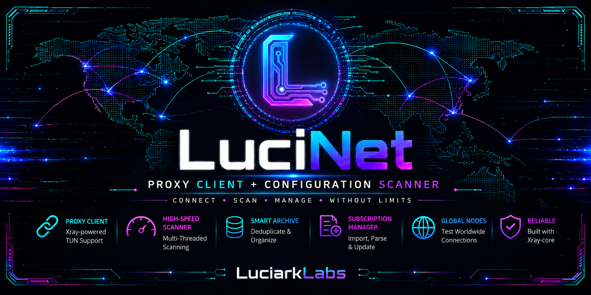
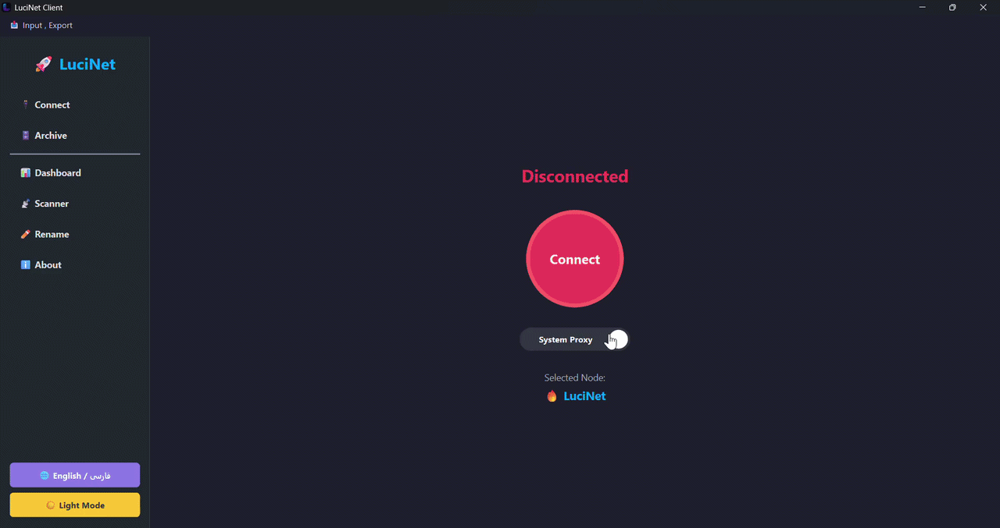
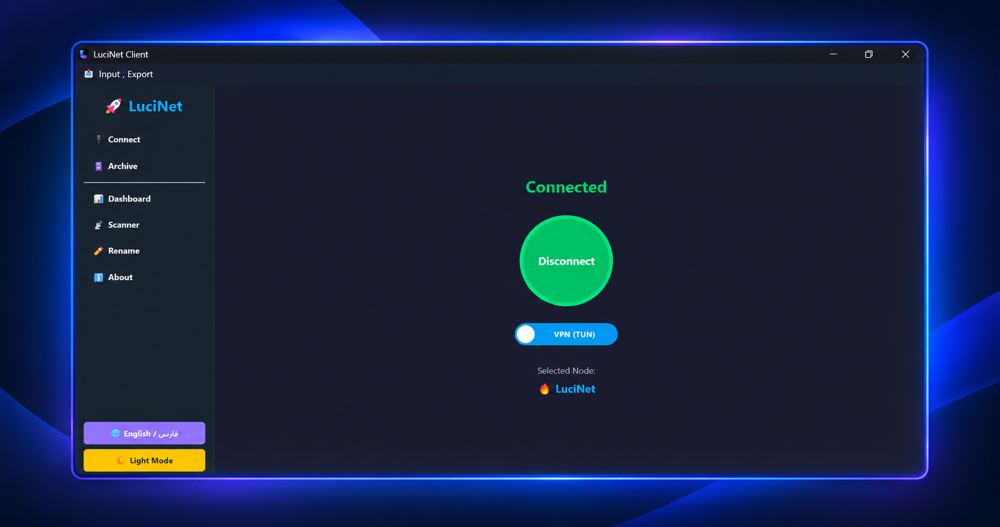
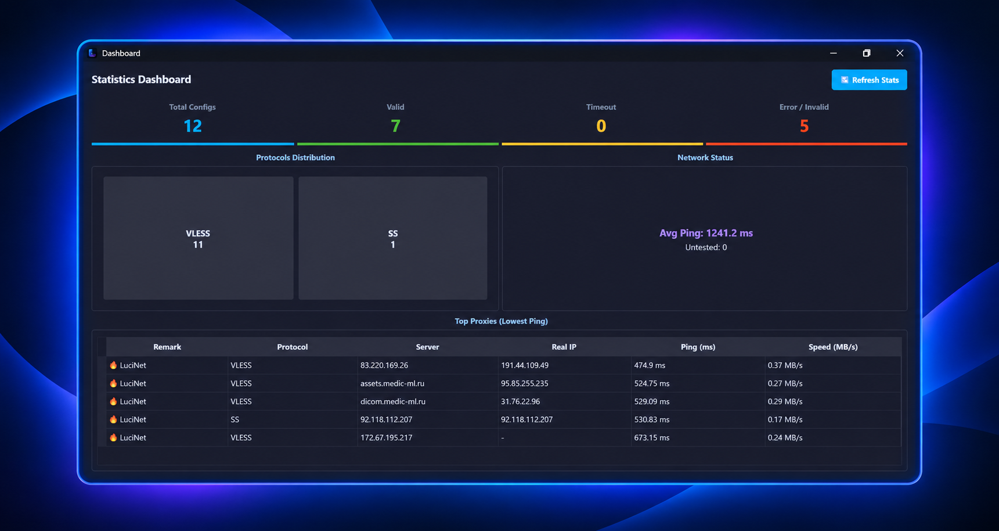
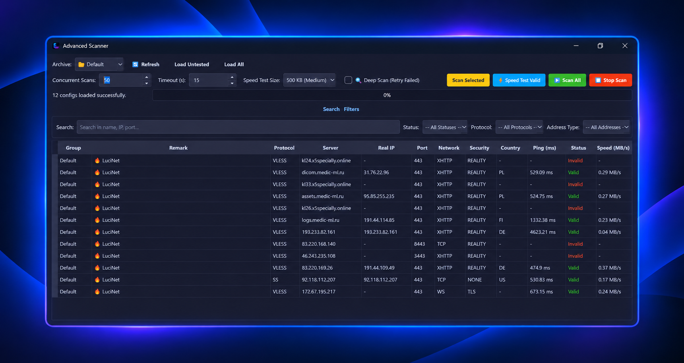
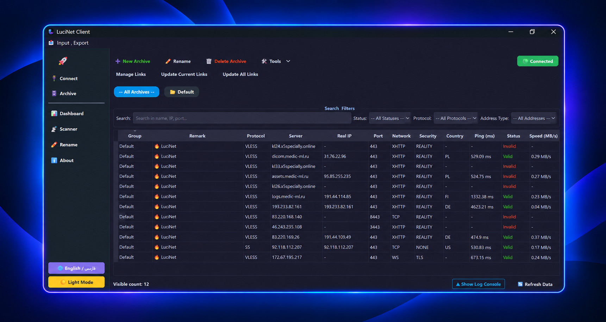

<div align="center">

  

</div>

<br>

<div align="center">

  

</div>

# 🚀 LuciNet

<p align="center">
  
  
  
</p>

**A Modern Proxy Client, Configuration Scanner & Management Platform**

## 📖 About LuciNet

**LuciNet** is an advanced GUI-based desktop application developed by **LuciarkLabs** for connecting to, testing, managing, and organizing proxy configurations.

Powered by **Xray-core** and built with **Python and PySide6**, LuciNet combines a full-featured proxy client with a high-speed configuration scanner, speed testing tools, subscription management, and advanced archive utilities in a single application.

LuciNet has evolved from a configuration scanner into a complete proxy management and connectivity platform, providing both everyday connection features and powerful tools for processing large configuration databases.

## ✨ Key Features

### 🌐 Proxy Client

- **Xray-powered Client:** Connect to proxy configurations directly through Xray-core.
- **Native TUN Support:** Native Windows TUN mode with advanced routing capabilities.
- **Smart Routing:** Intelligent traffic routing with DNS protection, loop prevention, and configurable network behavior.
- **VLESS Reality:** Support for VLESS with Reality parameters.
- **XHTTP (SplitHTTP):** Support for XHTTP configurations with intelligent parameter extraction.
- **Quick Connect:** One-click connect/disconnect control directly from the dashboard.
- **Smart UAC Handling:** Administrator privileges are requested only when required, such as when enabling TUN.

### 🔍 High-Speed Scanner

- **High-Speed Concurrent Scanning:** Test large numbers of configurations simultaneously using a multi-threaded Xray-core architecture.
- **Up to 1,000 Concurrent Tests:** The scanner can handle up to 1,000 simultaneous configuration tests.
- **Configurable Timeout:** Adjustable timeout from **1 to 60 seconds**.
- **Deep Scan:** Automatically re-test configurations that failed or timed out during the initial scan.
- **Real-Time Latency Testing:** Measure actual response latency through live proxy connections.
- **Speed Test:** Test download performance for valid configurations.
- **IPv4 / IPv6 Filtering:** Instantly filter and separate IPv4 and IPv6 configurations.
- **Real IP Detection:** Display the detected real server IP when available.
- **Country Detection:** Identify the country associated with configurations.

> **Performance Note:** Although LuciNet supports up to 1,000 concurrent tests, using **100 or fewer concurrent tests** is recommended for most networks. Excessive concurrency may overwhelm routers, NAT tables, or ISP infrastructure and can result in false-negative timeouts.

### 🗄️ Configuration & Archive Management

- **Advanced Archiving:** Organize and manage large configuration collections.
- **Deduplication:** Automatically detect and remove duplicate configurations.
- **Advanced Filtering:** Quickly search and filter configurations.
- **Bulk Rename:** Rename large numbers of configurations at once.
- **Emoji Tools:** Add predefined or randomized emojis to configuration names.
- **Automatic Numbering:** Automatically number configuration names.
- **Export Utilities:** Export configurations for further use.
- **Database Storage:** Store and manage configuration data using SQLite.

### 📥 Subscription Management

- **Subscription Import:** Import subscription URLs directly into LuciNet.
- **Automatic Parsing:** Parse imported subscription contents automatically.
- **Subscription Updates:** Update subscription-based configurations when needed.
- **Archive Integration:** Imported configurations can be organized and managed alongside existing archives.

### 📊 Dashboard & Monitoring

- **Smart Dashboard:** Real-time overview of configurations, connection status, and scanning results.
- **Connection Status:** Monitor the current proxy connection directly from the dashboard.
- **Network Statistics:** Display relevant network and configuration statistics.
- **Top Proxy Extraction:** Quickly identify and extract high-performing configurations.
- **System Information:** Monitor system and network-related information from within the application.

### 🎨 UI / UX

- **Modern PySide6 Interface:** Desktop UI designed specifically for LuciNet.
- **Dark & Light Themes:** Switch between Dark and Light modes dynamically.
- **Bilingual Interface:** Full **English and Persian (فارسی)** support.
- **Dynamic Language Switching:** Change the application language without restarting.
- **Animated Controls:** Smooth custom controls for switching between System Proxy and TUN modes.
- **Real-Time UI State Management:** Interface elements automatically adapt to active scanning and connection processes.

## 📥 Prerequisites

To run LuciNet from source code, ensure you have the following installed:

- [Python 3.10+](https://www.python.org/)
- Git

## 🛠️ Installation & Setup

### 1. Clone the repository

```bash
git clone https://github.com/LuciarkLabs/LuciNet.git
cd LuciNet
```

### 2. Install Python dependencies

```bash
pip install -r requirements.txt
```

### 3. Setup Xray-core

Download the required **Xray-core** release and extract it into a folder named `xray_core` in the root directory of the project.

Make sure the required Xray files are present, including:

```text
xray_core/
├── xray.exe
├── wintun.dll
├── geoip.dat
├── geosite.dat
├── LICENSE
├── LICENSE-Wintun
└── README.md
```

### 4. Run the application

```bash
python main.py
```

### 5. Build Executable (Optional)
To compile LuciNet into a standalone `.exe` file using PyInstaller:
```bash
pip install pyinstaller
pyinstaller --noconfirm --onedir --windowed --icon "assets/icon.ico" --name "LuciNet" --add-data "assets;assets" main.py
```


## 📸 Screenshots

### 🚀 VPN Client & Connect



### 📊 System Dashboard



### 📡 Real-Time Scanner



### 🗄️ Archive Management



## 📦 Releases

Pre-built Windows releases are available through the GitHub Releases page.

[View LuciNet Releases](https://github.com/LuciarkLabs/LuciNet/releases)

## 🏢 Developed by LuciarkLabs

**LuciNet** is developed and maintained by **LuciarkLabs**.

## 📜 License & Copyright

### LuciNet

Copyright (C) 2026 **LuciarkLabs**

LuciNet is licensed under the **GNU General Public License v3.0 (GPLv3)**.

See the [LICENSE](LICENSE) file for the full license text.

### Xray-core

LuciNet utilizes **Xray-core**, which is distributed under the **Mozilla Public License Version 2.0 (MPL 2.0)**.

See [xray_core/LICENSE](xray_core/LICENSE) for the applicable license.

### Wintun

LuciNet includes **Wintun**, developed by **WireGuard LLC**.

Wintun is distributed under its **Prebuilt Binaries License (PBL)**.

See [xray_core/LICENSE-Wintun](xray_core/LICENSE-Wintun) for the applicable license.